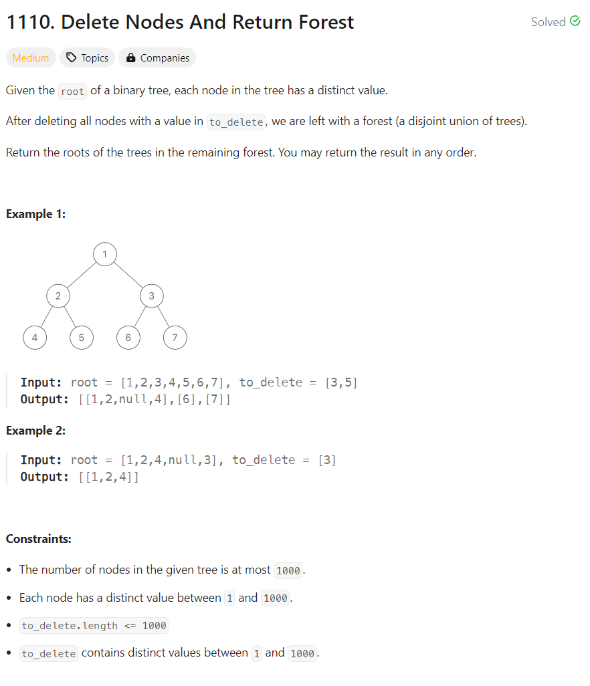
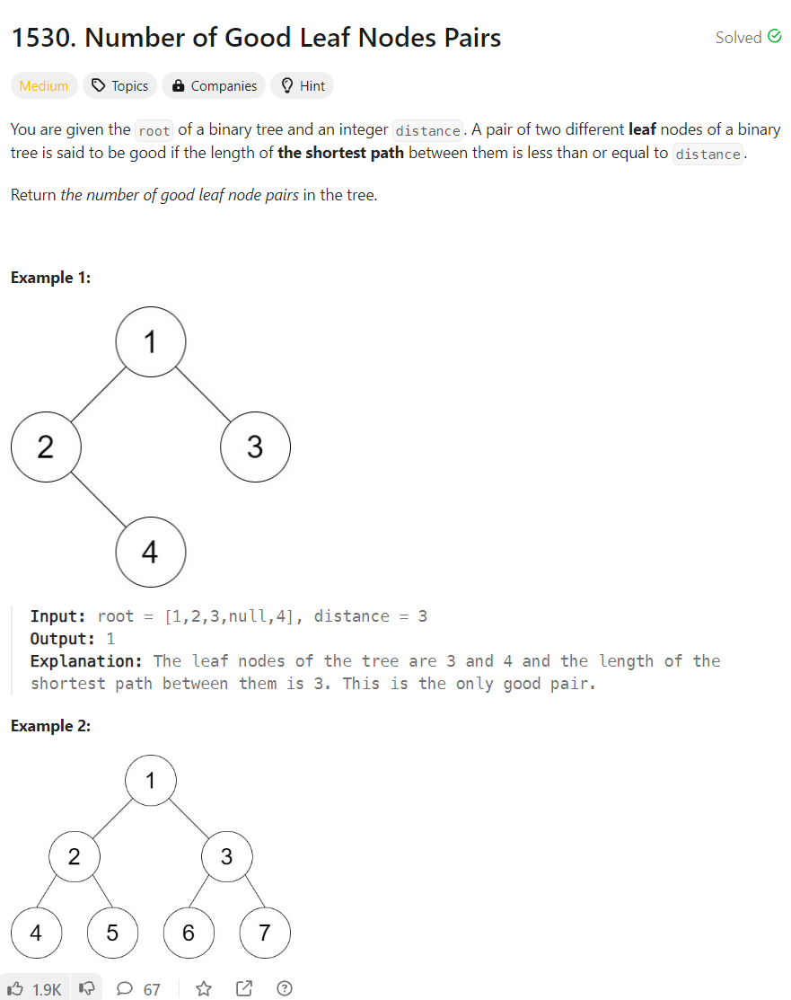
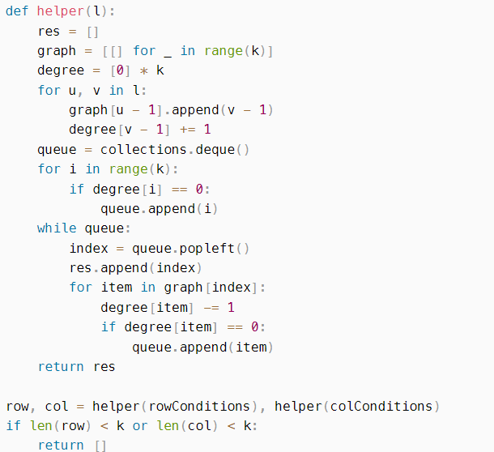

# Leetcode Notes for daily question

### 7/16/2024

A standard question for tree traversal. \
My thoughts:\
From back to top. When I face a node to delete, if the subtree under the node is clear for deletion, then I can plainly delete this node and put the children into result.\
So by using recurrsion, I deal with the node value after visiting all its children. If the node is to be deleted, change the left/right pointer of its parent and move children nodes into result.

Time: each node enter once. O(n)\
Space: constant memory except output list. O(n)

Best time ver:\
First traverse the tree to build a dictionary between value and node. Add parent pointer for each tree node. Then plainly loop through the **to_delete** list and for each deletion change its parent and move children to result.

Time: First traversal O(n), then O(len(o_delete))
Space: O(n) for dictionary, O(n) for changing the original tree to add one more pointer.

### 7/17/2024

thoughts1: 

maintain a window for each leaf node. store the path of previous leaf node in some structure. when facing new leaf node, compare to all path in the structure to find good leaf pairs.\
runtime = traverse(n)*len(path)(lgn)*len(structure)(n). one solution is calculate the distance in O(1), or try to delete some far away leaf node that is no longer usable.

thoughts2:

find all leaf node in one stack. track their depth. if two node depth differs more than distance, then they have no chance to be good.\
runtime: find leaf = o(n), compare is 2^distance likely to n\
can we have more cleaver method to determine if some node is no need to maintain in stack?\
distance >= 2+|depth difference of their parents|\
any traversal that expands from some center? 

Final thought:

traverse through each node, keep a dictionary holding the number of leaves at depth x below this node. When a node have leaves on both left and right side, check whether there is any satisifying leaves.

**for a tree issue, using recurring is always the first thought to solve problem in O(n)**

### 7/22/2024

Thoughts1:

for simplicity, when you see an edge(l,r), put r into children[l] then ask children to be come after parents. problem is when you find another edge (b,l), r will not be in children[b].\
this ask me to think of someway to maintain a data structure that can hold all the children of b and automatically join all the children together. This lead me to the structure of Union&find.\
However the U&F algo cannot know all the children in O(1), which is a waste(cause later I want to use a DFS to find all the children node and sort them, which requires a multiplier of |E|)

Thoughts2:

Then I changed my mind to maintain a dictionary set, for edge(l,r) simply add r into children[l]. Then the problem is how to find a Minimal Spanning Tree in the graph. I searched for several algos, none of them can handle cyclic non-connective directed graph.\
However, I actually don't need a MST. I only need to hold the conditions for all the nodes, which is, a rank. the node of lower ranks has to be in front of higher one. The sequence within a rank is not required. \
So I initialize the tire of each node to be 0. when see a edge(l,r), r to the tire large than l by 1. When a node is assigned a tire higher than before, overwrite and push its children into DFS.\
This makes me pass the question.
runtime: O(|v||E|^2)

Thoughts3:

Then I want to reduce the runtime. Here is the thought of 556ms:

Only calculate the in-degree of each node. start from the root node where the in-degree is 0 at the start. Then when each time go in a children, decrease the in-degree of the children by 1. By this way, the root node will be add to the res first(including the isolated node where has no children). The next node that in-degree is decreased to zero is the tire 1 node, which make the result no need for another sort. If the indegree of one node is 0, add this node to the next DFS/BFS(given the if condition, these two is the same). After all the BFS search, the node inside a cycle has no way to reduce its in-degree to zero, so the node inside a cycle wont be added into the res. So we just need to judge the len of res to see if it was a cyclic graph.\
Runtime O(|E|)

### 7/23/2024

by previous question, thought of using a binary search for the result. l=0,r=min(m,n), loop k to see if there can find a square of length k that satisfied the threshold. keep the l be the biggest satisfying value. This process takes O(lgn) time. Then the consideration is how to test whether k satisfied the threshold.\
initially I thought of plain loop, it cost $(n-k)*(m-k)*k*k$ time, which is O(n^4).

Daniel's thought:

first loop through the matrix. build a matrix stands for the summation of the value to the up left of that position. Then the sum of square(i,j),(i+k,j+k) can be calculated as $sum(i+k,j+k)-sum(i,j+k)-sum(i+k,j)+sum(i,j)$. So the runtime can be depressed to O(n^2)\
This is also a sense of DP.